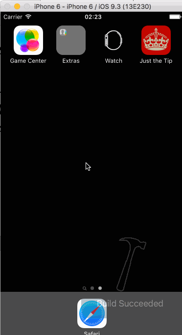

# "Just the Tip" Tip Calculator Demo App

This is a demo app for application submission to the CodePath iOS Mobile Bootcamp.

It is based on the instructions provided in [this Gist](https://gist.github.com/timothy1ee/6858b706304a2397a7e2).
Each commit describes the corresponding step of the instructions with step 3 split among several of the optional tasks.
See the full commit message for details about each commit with `git log --pretty=full`

Time Spent: I'd estimate 15-20 hours total including several abandoned ideas/implementations. This was also my first time developing with Xcode, which has a learning curve of its own.

Completed tasks:

* [x] Watch intro to Swift & implementation videos
* [x] Create initial Xcode project
* [x] Create settings page with poor/okay/great tip amounts
* [x] Optional design decision: removed settings modal in favor of +/- tip % buttons in main view
* [x] Save preferred tip amount as NSUserDefaults setting
* [x] Invert color black on white <=> white on black with double tap gesture anywhere on screen
* [x] Added app icon and launch screen with assets for several screen sizes
* [x] Use the locale setting for displaying numeric decimal amounts
* [x] Use a timestamp to remember bill amount for up to 10 minutes after app closed
* [x] Add ability to split the bill with up to 10 people via shake gesture

Notes:

I took step 3 as an invitation to experiment with the design a little. I don't like settings modals so I wanted to make all the features available from the main screen. Double tap for color scheme is a bit awkward but I mostly wanted to play around with gesture recognition. I also added a shake gesture recognizer for splitting the bill with as many as 10 people.

Figuring out launch screen image resolution for different devices was more difficult than I expected. There was conflicting advice on the internet. I finally decided to create each image manually in an editor, but I'm not 100% sure it was implemented correctly.

Walkthrough of all user stories:

GIF created with [LiceCap](http://www.cockos.com/licecap/).
